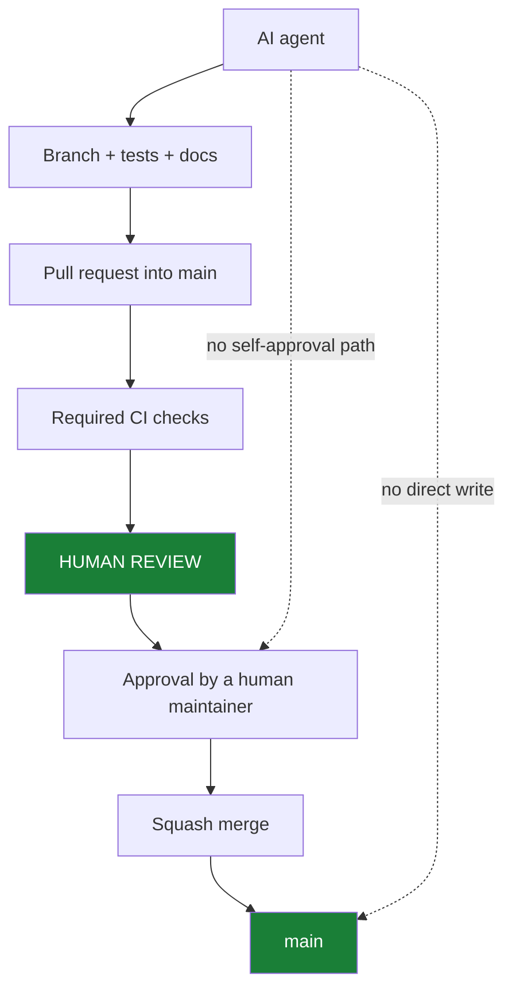

# AI Agent Governance

## Purpose

Trustvian is developed with substantial help from AI coding agents. This
document defines what such an agent may do to this repository, what it may
never do, and — the part that actually matters — which of those limits are
enforced by GitHub rather than by the agent's cooperation.

It is an evergreen policy. It describes roles, not people, and does not
record credentials, tokens, or account identifiers.

## Trust Model

An AI coding agent is a **contributor with no merge authority**, not an
administrator. It proposes changes; humans accept them.

The distinction Trustvian relies on is not "the agent is well-behaved." It is
that the agent's credential should be incapable of destructive administration
in the first place. An instruction file is a reminder; a permission boundary
is a control.

> **Technical capability is not authorization.** An agent that finds itself
> holding a credential able to perform a prohibited action must still not
> perform it — and that situation should be treated as a misconfiguration to
> report, not a convenience to use.

## Human vs Agent Authority

```text
Human Administrator
    │
    ├── repository governance (rulesets, settings, default branch)
    ├── emergency administration
    ├── credential management
    └── final merge authority

Human Maintainer
    │
    ├── review
    ├── approval
    └── merge

AI Agent
    │
    ├── implementation
    ├── tests
    ├── documentation
    ├── branch creation and push
    └── pull request creation

    NEVER: destructive administration
```

## Allowed Agent Operations

- Read repository contents, settings, rulesets, and CI configuration.
- Create short-lived branches and push to them.
- Open, update, and comment on pull requests.
- Read workflow runs, logs, and check results.
- Prepare a release: validation, tests, release notes, a release pull
  request, artifact and signature verification.
- Propose governance changes as documentation and as an explicit,
  human-reviewed plan.

## Prohibited Agent Operations

- Deleting, renaming, force-pushing, or rewriting the history of `main`.
- Pushing directly to `main`, bypassing the pull request path.
- Disabling, deleting, or weakening the `main` ruleset or any branch
  protection.
- Adding any agent, bot, automation identity, or its own credential as a
  ruleset bypass actor.
- Changing the repository default branch away from `main`.
- Deleting, moving, or force-updating a release tag; reusing a failed release
  candidate's version number.
- Deleting a GitHub Release, or repairing a failed release by mutating
  published history.
- Approving or merging its own pull request, or otherwise routing around
  required human review.
- Rotating, issuing, or altering credentials and secrets.

If a task appears to require one of these, the correct response is to stop and
ask a human — not to find a way.

## Credential Isolation

The security boundary is the credential, not this document.

An agent should authenticate as its own least-privilege identity, distinct
from any human administrator's:

```text
Human administrator credential        Agent credential
    │                                     │
    └── repository administration         ├── contents: read/write (branches)
        ruleset administration            ├── pull requests: read/write
        credential management             ├── metadata: read
                                          ├── actions: read
                                          └── packages: read

                                          NOT: administration
                                          NOT: ruleset administration
                                          NOT: secrets
```

Recommended minimum for a fine-grained personal access token scoped to this
repository alone:

| Permission | Level | Why |
|---|---|---|
| Metadata | Read | Mandatory for any fine-grained token |
| Contents | Read and write | Create and push short-lived branches |
| Pull requests | Read and write | Open and update pull requests |
| Actions | Read | Inspect workflow runs and check results |
| Packages | Read | Verify published container images |
| Issues | Read and write | Only if the agent triages issues |
| Administration | **None** | The whole point |
| Secrets, Environments, Webhooks | **None** | — |

A classic personal access token is not a substitute. Classic `repo` is a
single scope covering code, settings, and — for a user who administers the
repository — its rulesets. It cannot express "may push a branch, may not
rewrite governance," which is precisely the line this policy needs.

> **Known limitation.** When an agent runs with a human administrator's
> unrestricted credential, GitHub cannot distinguish the agent's API calls
> from the human's. Every restriction in this document then rests on the
> agent's compliance, which is defense in depth, not a boundary. Do not
> describe such a setup as secure; treat it as a temporary state to be fixed
> by issuing the agent its own token.

## Protected Branches

`main` is the canonical branch and the repository default.

```text
main

delete        → DENIED
force push    → DENIED
direct push   → DENIED
history rewrite → DENIED

normal write path:
    short-lived branch → pull request → required CI → human approval
        → squash merge → main
```

Changing the default branch away from `main` is a human-administrator
governance operation. Agents must not perform it.

The enforcing configuration is documented in
[REPOSITORY_GOVERNANCE.md](REPOSITORY_GOVERNANCE.md).

## Pull Request Requirements



No agent self-approval path may be designed, configured, or relied upon.
GitHub Actions is not permitted to approve pull requests in this repository,
and that setting is part of the audited configuration.

## Release Safety

An agent may prepare a release and verify one. It may not repair one.

```text
failed release candidate
        ↓
    fix branch
        ↓
    pull request
        ↓
        CI
        ↓
 human-reviewed merge
        ↓
 next immutable RC
```

A release candidate that failed keeps its version number forever. `v0.9.0`
took three candidates; `v0.9.0-rc.1` and `rc.2` remain in the history as
evidence of what failed and why. Recycling a tag would erase that, and an
agent must never do it — a failed release is fixed by moving forward, never by
rewriting what was published.

## GitHub Actions

Workflow privilege is scoped per job, not per repository:

| Workflow | Trigger | Privilege |
|---|---|---|
| `ci.yml` | push / PR on `main` | `contents: read` only — no secrets, nothing to leak to a fork pull request |
| `nightly.yml` | schedule, manual | `contents: read` only |
| `release.yml` | version tag | `contents: read` by default; the publish job adds `contents: write`, the container job adds `packages: write` and `id-token: write` for keyless signing |

Rules for changing this:

- The default `permissions:` at workflow level is `contents: read`. Widen it
  on a *job*, never on a workflow.
- Pull request CI must never gain write privilege. A fork's pull request runs
  untrusted code; the reason it is safe here is that the job holds no
  credential worth stealing.
- `pull_request_target` must not be introduced. It runs with the base
  repository's token in the context of untrusted code, and this repository has
  no use case that justifies it.
- Release privileges (`packages: write`, `id-token: write`) belong to the
  tag-triggered workflow only, and must not migrate into pull request CI.

## Emergency Administration

Recovery from a governance mistake is a deliberate human action: a signed-in
administrator editing the ruleset in the GitHub UI, where the change is
recorded in the repository's rule history.

It is deliberately **not** a standing bypass entry, and deliberately not
available through an agent credential. A bypass actor applies silently to
every push; editing a ruleset is visible, reversible, and has to be chosen.

## Security Invariants

AI agents and automated tools must never:

- delete `main`;
- rename `main`;
- force-push `main`;
- rewrite `main` history;
- disable or weaken the `main` ruleset;
- add themselves as ruleset bypass actors;
- change the default branch away from `main`;
- delete or move release tags;
- delete releases to repair failed releases;
- bypass required human review.

These restrictions apply even when the agent is technically authenticated
using credentials capable of performing the action.

Technical capability is not authorization.

## Related

- [Repository Governance](REPOSITORY_GOVERNANCE.md) — the enforced configuration
- [Branching Strategy](BRANCHING_STRATEGY.md) — the development model
- [CLAUDE.md](../CLAUDE.md) — the in-repository reminder for coding agents
