# Architecture

Trustvian is a single-module, single-tenant Go engine built as a
hexagonal core (`event` + `internal/*`) wrapped by a thin composition
root (`Engine`, root package) and two adapters (`cmd/trustvian`,
`internal/otel`). This document explains the system's shape; see
[DOMAIN.md](DOMAIN.md) for what each pipeline stage's data actually
means, [SECURITY.md](SECURITY.md) for the threat model, and
[PERFORMANCE.md](PERFORMANCE.md) for measured hot-path behavior.
Significant decisions behind this shape are recorded as ADRs in
[`adr/`](adr/). What's planned to change this shape next — and in what
order — is in [ROADMAP.md](ROADMAP.md) and [`tasks/`](tasks/).

## System diagram

```mermaid
flowchart LR
    subgraph ext["External"]
        OTelSDK["Application / OTel SDK / Collector"]
        JSONFile["JSON file"]
    end

    subgraph adapters["Adapters (internal/, or in-module)"]
        OTelAdapter["internal/otel\n(EventFromSpan)"]
        CLI["cmd/trustvian\n(analyze, baseline build)"]
    end

    subgraph core["Core (event + internal/*) — zero infrastructure deps"]
        Event["event.Event"]
        Features["internal/features"]
        Fingerprint["internal/fingerprint"]
        Baseline["internal/baseline\n+ internal/store"]
        Anomaly["internal/anomaly"]
        Trust["internal/trust"]
        Policy["internal/policy"]
    end

    Engine["Engine (root package)\ncomposition root"]

    OTelSDK -->|span| OTelAdapter
    JSONFile -->|JSON| CLI
    OTelAdapter -->|Event| Event
    CLI -->|Event| Event
    Event --> Features --> Fingerprint --> Baseline --> Anomaly --> Trust --> Policy
    Policy -->|Decision| Engine
    Engine -.wires.-> Event
    Engine -.wires.-> Baseline
    Engine -.wires.-> Policy
    Engine -->|Result| Consumer["Caller: CLI output, future export/Control"]
```



Dotted edges are composition (`Engine` constructs and holds these), not
data flow. Nothing under `core` imports `adapters`, `Engine`, or each
other except strictly downward along the pipeline — see
[Dependency direction](#dependency-direction).

## The pipeline

Every event flows through the same seven stages, in the same order:

```
Event → Features → Fingerprint → Baseline(read) → Anomaly → Trust → Policy → Decision
                                       ↑
                              Baseline(write) via explicit Observe()
```

| Stage | Package | Input → Output |
|---|---|---|
| Features | `internal/features` | `event.Event` → `Features` (stable + volatile dimensions) |
| Fingerprint | `internal/fingerprint` | `Features.Stable` → a deterministic `Fingerprint.ID` |
| Baseline | `internal/baseline`, `internal/store` | statistical history per `(ActorID, Environment, Fingerprint)` |
| Anomaly | `internal/anomaly` | `Features` + `Baseline` → `Anomaly{Score, Confidence, Contributors}` |
| Trust | `internal/trust` | `Anomaly` + identity + context → `Trust{Score, Risk}` |
| Policy | `internal/policy` | `Trust` + `Features.Stable` → `Decision` + `Explanation` |

`Engine` (the root `trustvian` package) is the composition root that
wires all of this together — see [`engine.go`](../engine.go).

Every stage but `Baseline` is a pure function. `Baseline` is
immutable-value-with-copy-on-write: `Baseline.Observe(...)` never
mutates its receiver, it returns a new `Baseline`. Concurrency-safe
storage of "the current `Baseline` for this key" is `internal/store`'s
job — it shards a lock per `(ActorID, Environment)` key so unrelated
actors never contend with each other.

## Analyze is read-only; Observe is the only write path

```go
result, err := engine.Analyze(ctx, ev)   // never touches the Baseline
learned, err := engine.Observe(ctx, result) // conditionally learns
```

`Observe` decides for itself whether `result` is safe to learn from —
see [Go SDK Guide § Observe and learning](sdk-guide.md#observe-and-learning)
and [Policy Guide § fail-closed, not fail-open](policy-guide.md#fail-closed-not-fail-open).
Callers never need to check `result.Decision` themselves before calling
`Observe`; it's always safe to call unconditionally.

## Cold start: two numbers, not one

A brand-new `Fingerprint` (an actor doing something Trustvian has never
seen it do before) scores as maximally novel —
`Anomaly.Score` near 1 — but with `Anomaly.Confidence` at 0.
`internal/anomaly` deliberately does not suppress `Score` for a novel
fingerprint: collapsing "how different is this" and "how much should
you trust that reading" into a single number would throw away
information a security decision needs.

The two are recombined in `internal/trust`:

```
effectiveAnomaly = Anomaly.Score * Anomaly.Confidence
TrustScore        = IdentityConfidence * (1 - effectiveAnomaly) * (1 - ContextRisk)
```

At `Confidence = 0`, `effectiveAnomaly` is 0 regardless of how novel the
event looks, so `TrustScore` falls back to identity and context alone.
This is why a first-ever, high-identity-confidence event doesn't get
blocked just for being new — see the walkthrough in
[Use Cases](use-cases.md) and the SDK example in
[Go SDK Guide § baseline maturity](sdk-guide.md#watching-trust-mature).

## Package boundaries

Only two packages are importable from outside this module: the root
`trustvian` package and `event`. Everything else lives under
`internal/`, which Go's compiler enforces.

```
trustvian/
├── trustvian.go, engine.go, options.go, result.go   # public: Engine, Option, Result
├── event/                                              # public: Event, Actor, Operation, Target, Context
├── cmd/trustvian/                                       # CLI (in-module, can import internal/*)
└── internal/
    ├── features/    fingerprint/    baseline/    store/
    ├── anomaly/     trust/          policy/
    └── otel/                                            # the ONLY package that imports go.opentelemetry.io/otel*
```

**Why `event` isn't under `internal/`, but `Decision`/`Policy`/`Config`
are.** `Event` is the one type every caller — in-module or not — must
*construct* just to call `Engine.Analyze` at all; leaving it internal
would make the SDK's own entry point uncallable from outside the
module. But Go's `internal/` restriction only blocks *importing* a
package — it does not block reading exported fields off a value you
already have. `result.Trust.Score` and `result.Decision == "block"`
both work fine from external code without importing anything beyond
the root package. So the types that would need to move out are only
the ones an external caller must *construct*: `Policy`,
`anomaly.Config`, `trust.Config`, `store.Store` implementations. None
of those has an external consumer yet, so none has moved — see
[Go SDK Guide § the public/internal boundary today](sdk-guide.md#the-publicinternal-boundary-today)
for what this means in practice, and [Limitations](../README.md#limitations)
for the current state.

**Why `internal/otel` is the only package that imports OpenTelemetry.**
The core engine (`event` through `internal/policy`, and `Engine`
itself) has zero OpenTelemetry dependency. A future OpenTelemetry
Collector processor is a separate, heavier deliverable (it needs the
`otelcol-builder` toolchain) that will live outside this module
entirely, so that dependency tree never touches the core engine's.

## Dependency direction

Verified directly, not asserted — `go list -deps` on every package:

```
event            → (stdlib only)
internal/features    → event
internal/fingerprint → internal/features
internal/baseline    → internal/features, internal/fingerprint
internal/store       → internal/baseline, internal/features, internal/fingerprint
internal/anomaly     → internal/baseline, internal/features, internal/fingerprint
internal/trust       → internal/anomaly
internal/policy      → event, internal/features, internal/trust
internal/otel        → event, internal/features   (+ go.opentelemetry.io/otel*)
trustvian (root)     → event, internal/{anomaly,baseline,features,fingerprint,policy,store,trust}
cmd/trustvian        → trustvian (root), event, internal/policy, internal/trust
```

Every edge points strictly toward an earlier pipeline stage or a leaf
(`event`). Nothing under `internal/` imports the root package or
`cmd/`, so there is no cycle: `internal/otel` is the only package with
an external (non-stdlib) import, and the root package + `cmd/trustvian`
are the only ones that assemble the pipeline stages together.

## Storage boundary

`internal/store.Store` is the only seam between the pipeline and how
`Baseline` data is held:

```go
type Store interface {
	Get(ctx context.Context, key baseline.Key) (baseline.Baseline, bool)
	Observe(ctx context.Context, key baseline.Key, fp fingerprint.Fingerprint, vol features.VolatileFeatures, now time.Time) (baseline.Baseline, error)
}
```

Two methods, matching `Baseline`'s actual access pattern exactly — not
a generic repository. The only implementation today is
`store.InMemory` (baselines do not survive a process restart; see
[Limitations](../README.md#limitations) and
[ROADMAP.md](ROADMAP.md)). No database driver is imported anywhere in
this module. A future persistent implementation (file-backed, or
backed by an external store) is additive: implement `Store`, wire it
in via `trustvian.WithStore(...)`, and every pipeline package is
unaffected — none of them know `Store` exists; only `Engine` does.

## Relationship to Trustvian Control/Cloud

Nothing in this repository implements Trustvian Control or Trustvian
Cloud, and this repository has no dependency — direct or planned — on
either. The relationship is one-directional and adapter-shaped, the
same pattern as OpenTelemetry and storage:

```
Trustvian Control/Cloud  --(future, separate deliverable)-->  reads Decisions/exports from
                                                                the core engine via its public API
```

A future Control/Cloud product would be a *consumer* of this module's
public API (`Engine`, `Result`) or of telemetry `internal/otel`
enriches, exactly like any other embedder — it would not become a
dependency the core links against, and the core would gain no
awareness of multi-tenancy, RBAC, or centralized management to support
it. See [ROADMAP.md](ROADMAP.md) for what's implemented vs. planned,
and [`tasks/016-control.md`](tasks/016-control.md) for this constraint
recorded as a standing placeholder ahead of any real Control design
work.

## Hot-path protection in practice

This isn't just a stated principle — it's enforced by benchmarking.
Adding `internal/fingerprint`, `internal/baseline`, `internal/trust`,
and `internal/policy` benchmarks (see [PERFORMANCE.md](PERFORMANCE.md))
surfaced a real, previously invisible cost: `Engine.Analyze` was
calling `fingerprint.Compute` twice per event — once directly, once
again inside `anomaly.Score`. Passing the already-computed
`fingerprint.Fingerprint` into `Score` instead of recomputing it
measured a 23% latency reduction and 44% fewer allocations on
`Engine.Analyze`, and took `anomaly.Score`'s common-case path to zero
allocations. See [ADR 0005](adr/0005-fingerprint-computed-once-per-analyze.md).

## Design choices worth knowing before you extend this

- **Policy is data, not code.** `policy.Policy` is a plain value — an
  ordered `[]Rule` plus a mandatory default — evaluated by one generic,
  deterministic `Evaluate`. There's no per-rule Go closure or strategy
  interface. This is what will let a future YAML/file policy loader
  exist as a pure adapter producing the same `Policy` value, without
  touching the evaluator.
- **`Store` is a narrow port**, not a generic repository:
  `Get`/`Observe`, nothing else. It matches `Baseline`'s actual access
  pattern (read the snapshot, apply one incremental update).
- **No global engine state.** `Engine` is always constructed
  explicitly via `NewEngine(...)` and passed around; there's no
  default/singleton engine for convenience. This is deliberate, not an
  oversight — see Architecture Risk #8 in the project's design notes.
- **No plugin/strategy interface for anomaly algorithms.** There is one
  deterministic algorithm (noisy-OR combination of categorical
  novelty, latency deviation, error deviation, and a sensitive-target
  floor). Add an interface when a second algorithm actually exists,
  not before.
