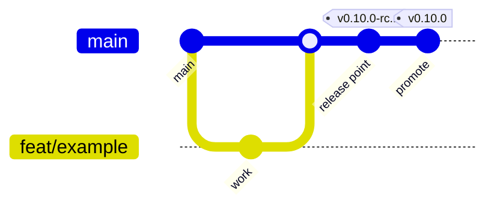
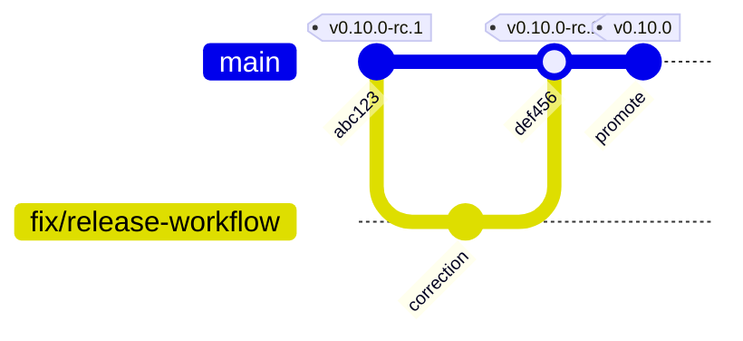

# Trustvian Branching Strategy

**Main-based development with short-lived branches and immutable release
tags.** One long-lived branch, one pull-request target, and every release
identified by a tag that is never moved.

This document is the contract for where work happens. For how a release is
produced and verified, see the [Release Guide](release-guide.md); for how to
run the gates locally, see [CONTRIBUTING.md](../CONTRIBUTING.md).

## Goals

- A contributor can tell, in one sentence, where to branch from and what to
  target.
- `main` is always releasable, and that claim is enforced by CI rather than
  by memory.
- Releases are reproducible from a commit, not assembled on a branch.
- The number of permanent branches stays at the minimum that the project's
  actual support commitments require.

## Core Principles

1. **`main` is the trunk.** Everything merges into it; every release tag
   points at a commit that is on it.
2. **Branches are short-lived and single-purpose.** Days, not weeks. A
   branch exists to carry one reviewable change to a pull request.
3. **Tags are immutable.** A published tag — release candidate or final — is
   never moved, deleted, re-pointed, or reused. A failed candidate stays as
   the record of what failed.
4. **A release candidate is a tag, not a branch.** Stabilization happens by
   verifying a candidate and, if needed, fixing forward on `main`.
5. **A final release is promoted from the exact commit a candidate verified**
   whenever no correction was required.
6. **Maintenance branches are created on demand, never in advance.**

## Branch Model



A candidate that fails is corrected on `main`, and the next candidate takes
the next number — the failed tag stays where it is:



## Long-Lived Branches

### `main`

| Property | Value |
|---|---|
| Purpose | The trunk. The only branch every change reaches, and the only branch release tags are cut from. |
| Direct pushes | **No.** Every change arrives by pull request. |
| Required CI | `ci.yml` on pull request and on push (see [Branch Protection](#branch-protection)) |
| Merge policy | Squash merge (see [Merge Strategy](#merge-strategy)) |
| Release relationship | Every `vX.Y.Z-rc.N` and `vX.Y.Z` tag points at a commit on `main` |
| Protection | PR required, required status checks, no force push, no deletion |

`main` is the repository's default branch and the base of every pull
request. There is no second integration branch: see
[Why no permanent `develop`](#why-no-permanent-develop).

### `release/X.Y` — conditional, not standing

A maintenance branch exists **only** while an older release line still needs
patches and `main` has moved past it. See
[Maintenance Releases](#maintenance-releases). None is created in advance,
and one that has reached end of support is left in place as history rather
than being kept current.

## Short-Lived Branches

Every other branch is temporary, owned by one change, and deleted when its
pull request merges. Branch from the current `main`; rebase onto `main` if
it moves underneath you.

A branch should carry one reviewable change. If a branch needs a paragraph
to explain what it contains, it is probably two branches.

## Branch Naming

```text
<type>/<short-description>
```

Lowercase, hyphenated, no ticket-number-only names, no personal prefixes.

| Prefix | Use for |
|---|---|
| `feat/` | New capability or public API surface |
| `fix/` | Behavioral defect |
| `docs/` | Documentation only |
| `refactor/` | Internal change with no behavior change |
| `test/` | Tests, fixtures, benchmarks |
| `ci/` | Workflows and repository automation |
| `build/` | Build, packaging, Dockerfile, module wiring |
| `chore/` | Dependencies, housekeeping |
| `security/` | Hardening and vulnerability fixes (see [Security Fixes](#security-fixes)) |

Examples:

```text
feat/webhook-alert-routing
fix/postgres-readiness-after-reconnect
docs/operations-backup-restore
ci/validate-action-references
security/webhook-signature-validation
```

## Pull Request Flow

```text
issue or task
   ↓
branch from main:  feat/<description>
   ↓
implement + run the local gates (CONTRIBUTING.md)
   ↓
push branch
   ↓
open a pull request against main        ← always main; there is no other target
   ↓
CI runs the full gate set
   ↓
review
   ↓
squash merge into main
   ↓
delete the branch
```

**Every pull request targets `main`.** That is the whole rule, and it is
what makes the project approachable to a first-time contributor.

Keep pull requests small enough to review in one sitting. Unrelated changes
belong in separate pull requests, because the unit that gets reverted,
bisected, and cited in a changelog is the merge.

## Merge Strategy

**Squash merge is the default.** One pull request becomes one commit on
`main`, which keeps the trunk bisectable, makes a revert a single operation,
and keeps work-in-progress commits out of the permanent history.

Exceptions, both rare:

- **Merge commit** when a series of commits is individually meaningful and
  worth preserving — a migration whose steps must stay separable, for
  example.
- **Rebase merge** is not used; it produces the same history as squash for
  single-commit branches and loses the pull-request association for longer
  ones.

Published history is never rewritten. A mistake on `main` is corrected by a
follow-up commit, not by a force push.

### Commit messages

Trustvian uses short, imperative subjects describing the change — the
convention the existing history already follows:

```text
Add PostgreSQL backup restore upgrade path
Fix release workflow refs and prereleases
Verify workflow action refs via git ls-remote
```

Conventional Commits (`feat:`, `fix:`) is **not** adopted. It earns its
ceremony when a tool derives versions or changelogs from commit subjects;
here the changelog is written deliberately and versions are chosen by a
maintainer, so the prefix would add process without adding information. The
branch prefix already carries the category.

Keep the subject under ~72 characters, and use the body for why the change
is shaped the way it is.

## Release Candidates

A release candidate is a tag on `main`. There is no release branch, and
nothing is frozen.

```text
main@<sha>
   ↓
tag vX.Y.Z-rc.N (annotated)
   ↓
release workflow: gates → binaries → checksums → container → scan
                  → publish → sign → attest
   ↓
verification against the published artifacts
```

A candidate marks itself as a prerelease: it never becomes GitHub's "Latest
release", and it never moves the floating container tags. Only a stable
release does either.

## Stable Releases

```text
verified vX.Y.Z-rc.N at <sha>
   ↓  same commit, no source change
tag vX.Y.Z (annotated)
   ↓
release workflow
   ↓
binaries + checksums, container image, signature, SBOM, provenance,
floating container tags (X.Y and latest) move to this release
```

**The invariant:** when a candidate verifies and requires no correction, the
final tag is created from *that same commit*. If anything at all changed —
source, workflow, dependency, documentation — the result is a new candidate,
not a promotion.

What each artifact contains and how to verify it is the
[Release Guide](release-guide.md)'s job, not this document's.

## Failed Release Candidates

```text
vX.Y.Z-rc.1  →  verification fails
   ↓
branch from main: fix/<what-failed>
   ↓
pull request → CI → review → main
   ↓
tag vX.Y.Z-rc.2 at the new commit
```

The failed tag stays exactly where it is. It is the evidence of what was
attempted and what the pipeline caught — the most useful record a release
process produces. Candidate numbers only ever increase.

Never move, delete, re-point, or reuse a published candidate tag.

## Hotfixes

While `main` still represents the released line — the common case — a
hotfix is an ordinary change that happens to be urgent:

```text
main (still the v0.9 line)
   ↓
fix/<the-defect>  →  PR  →  CI  →  main
   ↓
v0.9.1-rc.1  →  verification  →  v0.9.1
```

The candidate step is not skipped for urgency. It is the only thing that
proves the fix ships correctly, and it costs one workflow run.

If `main` has already moved on to work that must not ship in a patch, the
fix goes to a maintenance branch instead.

## Maintenance Releases

A maintenance branch is created **only** when both are true:

1. an older release line still needs supported patches, and
2. `main` has advanced past it with changes that must not ship in that
   patch.

```text
release/0.9            created from the v0.9.0 tag, when needed
   ↓
fix/<defect>  →  PR targeting release/0.9  →  CI
   ↓
v0.9.2-rc.1  →  verification  →  v0.9.2
```

Rules:

- Fix on `main` first when the defect exists there, then cherry-pick to the
  maintenance branch — so the next minor release cannot regress a fix that
  an older line already carries.
- If the defect exists *only* on the older line, fix it on the maintenance
  branch and note why it does not apply to `main`.
- Never create maintenance branches speculatively. A branch per release, kept
  green forever, multiplies CI cost and drift for support nobody asked for.

Pre-`v1.0`, Trustvian supports the latest release line only, so no
maintenance branch is expected. See
[.github/SECURITY.md](../.github/SECURITY.md).

## Security Fixes

A vulnerability must not be developed in a public branch: the branch name,
the diff, and the tests describe the exploit before a fix exists.

```text
private report (GitHub Security Advisory)
   ↓
private fork created from the advisory
   ↓
fix + tests reviewed there
   ↓
merged to main at disclosure time
   ↓
release (normal candidate → stable flow)
   ↓
advisory published with the fixed version
```

Ordinary hardening with no embargo — input validation, a dependency bump,
tightening a check — is normal work on a `security/` branch and needs none
of this.

Reporting and triage are covered by
[.github/SECURITY.md](../.github/SECURITY.md).

## Semantic Versioning

```text
MAJOR   incompatible public API change
MINOR   backward-compatible capability
PATCH   backward-compatible fix
```

Release candidates are `vX.Y.Z-rc.N`, numbered from 1 and increasing within
a version.

### Pre-`v1.0` discipline

Trustvian is pre-`v1.0`, where SemVer permits breaking changes in a minor
release. That permission is not a license to break users:

- A breaking change to the public API (`event`, `alert`, `config`, and the
  root package) lands in a **minor** bump, never a patch.
- It is called out in `CHANGELOG.md` with the migration a consumer must
  perform.
- A patch release contains fixes only — no API change, no behavior change
  a consumer could be surprised by, no storage-schema change.
- The persisted-state contract is stricter than the API contract: any change
  to the stored `Baseline` shape bumps the storage schema version, whatever
  the release number does. See the
  [Operations guide](operations.md#compatibility-matrix).

## Branch Protection

`main` should be protected by a repository ruleset requiring:

| Setting | Value | Why |
|---|---|---|
| Pull request required | yes | No direct pushes to the trunk |
| Required status checks | the `ci.yml` jobs below | "`main` is releasable" must be enforced, not assumed |
| Strict (branch up to date) | yes | A check that passed against stale trunk proves less |
| Block force pushes | yes | Published history is never rewritten |
| Block deletion | yes | — |
| Required approvals | 1 once a second maintainer exists | Self-approval is theatre with a single maintainer |
| Conversation resolution | yes | Review comments are not lost in a merge |

Required check names, exactly as `ci.yml` reports them:

```text
Root module
Processor module (GOWORK=off)
Examples module (GOWORK=off)
Backup, restore & upgrade
Release build (dry run)
Container image (build only)
Workflow action references
Reference deployment
```

Nightly jobs (`PostgreSQL stress tier`, `Reference deployment smoke test`,
`Reference deployment recovery drill`) are **not** required checks — they are
scheduled tiers, and requiring them would block every pull request on work
that is valuable as a trend. The release checklist consults them instead.

Tags carry no protection rule: immutability is a process commitment, and the
release workflow refuses to publish a tag whose commit does not match.

## Automation

Automated pull requests — dependency updates in particular — follow the same
path as human ones: a branch, a pull request into `main`, the full CI gate
set, and a maintainer merge. A bot never gets a route around the checks that
gate a release, because a dependency bump is exactly the kind of change that
can break a build or introduce a vulnerability.

Use `chore/` for dependency branches when creating them by hand.

## Examples

**Feature**

```text
feat/webhook-alert-routing  →  PR → main  →  (ships in the next minor)
```

**Bug fix**

```text
fix/postgres-readiness-after-reconnect  →  PR → main  →  (ships in the next patch)
```

**Release**

```text
main@abc123  →  v0.10.0-rc.1  →  verification passes  →  v0.10.0 at abc123
```

**Failed candidate**

```text
main@abc123  →  v0.10.0-rc.1  →  verification fails
ci/fix-release-step  →  PR  →  main@def456  →  v0.10.0-rc.2  →  v0.10.0 at def456
```

**Maintenance patch** (only with a live maintenance branch)

```text
release/0.9  →  fix/<defect>  →  PR  →  v0.9.2-rc.1  →  v0.9.2
```

## Anti-Patterns

- **A long-lived integration branch beside `main`.** It doubles CI, drifts,
  and forces periodic sync merges that review nothing.
- **Long-lived feature branches.** Merge conflicts grow with age, and the
  review at the end is too large to be real.
- **Direct pushes to `main`**, including by maintainers.
- **Force pushes to a protected branch**, or any rewrite of published
  history.
- **Moving, deleting, or reusing a release tag** — especially a failed
  candidate's.
- **Skipping the candidate for an urgent fix.** Urgency is when the
  verification matters most.
- **A release branch with no maintenance need**, or a maintenance branch per
  version created in advance.
- **Mixing unrelated changes in one pull request**, which makes the merge
  unrevertable in practice.
- **Committing generated release artifacts** (`dist/`, SBOMs, images);
  releases carry them, the repository does not.

## Why This Model

**Why main-based with short-lived branches?** Trustvian's releases are
already defined by tags and reproduced by a workflow that re-runs every gate
against the tagged commit. Nothing about producing a release needs a branch
to stage it. What the project does need — a trunk that is always releasable,
small reviewable changes, and a single obvious target for outside
contributors — is exactly what this model provides.

**Why not GitFlow?** GitFlow's `develop`, `release/*`, and `hotfix/*`
branches exist to stabilize a release while new work continues, and to
support many parallel released versions. Trustvian stabilizes with release
candidates on the trunk, and supports one release line. Adopting GitFlow
would add three branch classes and a merge matrix to solve problems the
project does not have.

**Why no permanent `develop`?** <a id="why-no-permanent-develop"></a>
It provided no release isolation. Because every change accumulated on
`develop` and was merged to `main` as a single wholesale pull request at
release time, the review unit was "everything since the last release" — the
opposite of a small reviewable change — while the individual changes reached
`develop` with no pull request at all. It also required periodic `main` →
`develop` sync merges purely to undo drift the split created, and it left
contributors with two plausible targets. Pull-request validation plus
immutable candidate tags give the isolation `develop` was supposed to
provide, at one branch instead of two.

**How do candidate tags replace a release-staging branch?** A staging branch
answers "what exactly will ship, and is it good?" A candidate tag answers the
same question with a stronger guarantee: it names one immutable commit, and
the artifacts under test are the ones the pipeline actually published. Fixes
go forward on the trunk and the next candidate is cut, so no change ever
exists only on a branch that must later be merged back.

**When do maintenance branches become justified?** When Trustvian commits to
patching a release line that `main` has moved past — for example after
`v1.0`, supporting `1.0` while `main` works toward `1.1`. Until that
commitment exists, the branch would be pure overhead.

## Related

- [Release Guide](release-guide.md) — producing and verifying a release
- [CONTRIBUTING.md](../CONTRIBUTING.md) — the local gates and module layout
- [.github/SECURITY.md](../.github/SECURITY.md) — reporting vulnerabilities
- [Operations](operations.md) — upgrade and compatibility contracts
