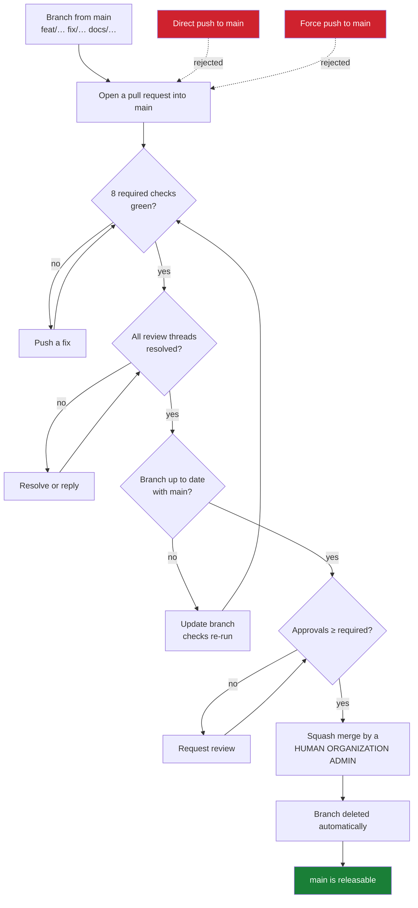

# Repository Governance

How the branching model in
[BRANCHING_STRATEGY.md](BRANCHING_STRATEGY.md) is enforced by GitHub, rather
than by everyone remembering it.

The model is: short-lived branches, pull requests into `main`, squash merge,
immutable release tags. A model that only lives in a document drifts. This
page records the configuration that makes it mechanical, why each rule is
there, and the conditions under which it should change.

Nothing here is a secret. Tokens, actor identifiers, and account details are
deliberately absent — this describes policy, and the live configuration is
readable by anyone with repository access.

## What is enforced

Two repository rulesets and three repository settings.

| Ruleset | Applies to | Effect |
|---|---|---|
| `Protect main` | `refs/heads/main` | Pull request, checks, squash, linear history, no force push, no deletion |
| `Protect release tags` | `refs/tags/v*` | No deletion, no update, no force-move |

| Repository setting | Value |
|---|---|
| Merge commits | disabled |
| Rebase merging | disabled |
| Squash merging | enabled |
| Delete branch on merge | enabled |

Squash is not merely the convention — it is the only merge button the
repository offers, and the ruleset independently rejects anything else.

Rulesets were chosen over classic branch protection because they are
readable through the API as *effective* rules, they apply to tags as well as
branches, and their bypass list is explicit rather than an implied
administrator exemption.

## Authority model

```text
Human Admin (Organization Admin)
    │
    ├── repository governance
    ├── emergency administration
    ├── credential management
    ├── review and approval
    └── FINAL MERGE into main

Maintainer
    │
    ├── review
    └── approval

AI Agent
    │
    ├── implementation
    ├── tests
    ├── documentation
    ├── branch push
    └── PR creation

    NEVER:
    destructive administration
```

Rulesets enforce the *branch* half of this: nobody, of any role, can push to
`main`, force-push it, or delete it. The *role* half — that an agent does not
administer governance — is enforced by which credential the agent holds, and
is documented in [Agent Governance](AGENT_GOVERNANCE.md#credential-isolation).

## The pull request flow



A new push to the branch dismisses existing approvals, because an approval
describes a diff that no longer exists.

## Required status checks

All eight are reported by `.github/workflows/ci.yml` through the GitHub
Actions app, and every one of them runs unconditionally on every pull request
into `main` — no `paths:` filter, no `if:` condition:

```text
Root module
Processor module (GOWORK=off)
Examples module (GOWORK=off)
Backup, restore & upgrade
Release build (dry run)
Container image (build only)
Workflow action references
Reference deployment
```

That property is load-bearing. A required check that is conditionally skipped
never reports, and a pull request waiting on a check that will never arrive is
indistinguishable from a broken repository. Before adding a `paths:` filter to
any of these jobs, remove it from the required list first.

Each required check is pinned to the app that produces it, so a third party
cannot satisfy a gate by reporting a same-named status.

Checks are **strict**: a branch must be up to date with `main` before it can
merge, so the checks that pass are the checks for the code that will actually
land.

Nightly jobs are excluded on purpose — see
[Branch Protection](BRANCHING_STRATEGY.md#branch-protection).

## Review authority

At least one human approval is policy for every pull request into `main`.

| Authority | Who holds it |
|---|---|
| Review and approval | An authorized human maintainer **or** an Organization Admin |
| Final merge into `main` | A human Organization Admin **only** |

One person may hold every role — Organization Admin, maintainer, reviewer, and
final merger. The policy requires one valid human approval plus an admin
merge; it does not require two separate people. A maintainer who is not an
Organization Admin may approve but must not perform the merge.

Organization Admin status is an additional authorization to merge, never
permission to bypass. An admin's merge must satisfy the same pull request,
checks, approval, and conversation-resolution rules as anyone else's.

### Enforced value today: `0`

The policy above is `1`. The **enforced** setting is `0`, and the gap is
deliberate and documented rather than hidden.

Trustvian has exactly one human: a single Organization Admin who is also the
only collaborator, with no other maintainers and no teams. GitHub does not
permit a pull request's author to approve their own pull request. Setting the
requirement to `1` today would make every pull request permanently unmergeable
— including any that fixes the setting — because no second human exists to
supply the approval.

Raising it is therefore blocked on a reviewer existing, not on anyone's
opinion. Until then the one-approval rule is **procedural, not enforced**, and
this document does not claim otherwise.

`require_extra_approval_for_unattributed_changes` is disabled for the same
reason. GitHub enables it by default; with a single maintainer it silently
raises the effective requirement to one approval for any commit whose author
cannot be linked to a GitHub account — including the `Co-Authored-By:`
trailers this repository's history carries.

`require_last_push_approval` is likewise disabled. It is inert below one
required approval, and when the requirement is raised it must be evaluated
against the single-admin case rather than switched on reflexively: it demands
that the most recent push be approved by someone *other than* the pusher,
which is correct for agent-authored work and impossible for an admin's own
branch.

### Making it enforceable

Two changes, in this order:

1. **Give the agent its own identity.** A machine account with a
   least-privilege token (see
   [Agent Governance](AGENT_GOVERNANCE.md#credential-isolation)) makes
   agent-authored pull requests arrive from a different login, so the
   Organization Admin's approval becomes a genuine second-party review.
2. **Then set required approvals to `1`.** Every agent-authored change is
   gated behind human review from that point on.

After step 2, a pull request the Organization Admin wrote *by hand* still has
no eligible reviewer and is intentionally unmergeable. That is the correct
outcome of a one-approval policy with one human, and it is resolved by adding
a second maintainer — not by adding a bypass.

| Setting | Today | After step 1 | With a second maintainer |
|---|---|---|---|
| Required approving reviews | `0` | `1` | `1` |
| Require last push approval | off | off | on |
| Extra approval for unattributed changes | off | off | on |

At three or more maintainers, raise approvals to `2` for changes touching
`internal/policy`, `internal/baseline`, `internal/trust`, or
`.github/workflows/release.yml` — the decision path and the publishing path.
That is the point at which `CODEOWNERS` becomes worth adding; with one
maintainer it would name the same person on every line and require an
approval they cannot give.

## Merge authority

GitHub has **no native rule** that restricts who may perform a merge by
organization role. This was investigated rather than assumed:

| Mechanism | Can it express "only an Organization Admin may merge"? |
|---|---|
| Repository rulesets | No. Rulesets gate *what* may reach a ref, not *who* performs the merge. Their only actor concept is `bypass_actors`, which grants exemption from the rules — the opposite of what is wanted |
| Organization rulesets | Same rule vocabulary; no merge-actor restriction |
| Classic branch protection `restrictions` | Closest native mechanism: an allow-list of users/teams that may push to, and therefore merge into, the branch. It enumerates identities rather than expressing the *role*, and is unavailable to this organization's plan |
| Custom repository roles | Not available on this organization's plan |
| Required status checks | Cannot help: no check can know who will click merge, because the merger does not exist until the merge happens |
| Merge queue | Actively harmful here — see below |

So the merge boundary is enforced by **credentials**, not by a branch rule:
whoever holds a credential with write access to the repository can merge a
pull request that satisfies the rules. Restricting the set of humans and
tokens holding that access *is* the enforcement mechanism.

This is why the agent credential recommendation in
[Agent Governance](AGENT_GOVERNANCE.md#credential-isolation) matters more than
any document: an agent token without merge rights cannot merge, whatever it is
instructed to do. Conversely, while an agent runs with the Organization
Admin's own unrestricted credential, GitHub sees the admin's authority and the
boundary is compliance rather than control.

### Merge queue

Not enabled, and it must not be. A merge queue makes GitHub's own automation
perform the final merge: the admin approves entry to the queue, and a bot
commits the result. That directly contradicts a policy whose point is that a
named human performs a deliberate final action.

### Auto-merge

Disabled repository-wide (`allow_auto_merge: false`). Auto-merge converts the
merge into a background event that fires whenever the last check goes green —
exactly the deliberate human step this model reserves for an Organization
Admin. An agent must never enable it.

## Final-merge checklist

For the Organization Admin performing the merge:

```text
[ ] PR targets main
[ ] required CI passed
[ ] branch is current where required
[ ] >=1 valid human approval exists
[ ] no stale approval remains
[ ] conversations resolved
[ ] no unexpected privileged workflow change
[ ] squash commit/title acceptable
[ ] I am intentionally performing the final merge as a Human Organization Admin
```

The seventh line is the one worth slowing down for: a change to
`.github/workflows/`, a new `permissions:` block, or a new action reference
deserves a second look, because it is the part of a diff that can alter what
CI itself is allowed to do.

## Bypass

**No bypass actors are configured on either ruleset.** Administrators are
subject to the same rules as everyone else.

This is the deliberate choice. The checks exist because `v0.9.0` needed three
release candidates to ship, and each failure was something no one predicted:
an action version that never existed, then a container repository name that
could not be lowercase. A gate that the person most likely to be in a hurry
can step around would not have caught either.

The escape hatch is editing the ruleset itself — visible in the repository's
rule history, deliberate, and reversible — rather than an exemption that
applies invisibly to every push.

## Release tags

`refs/tags/v*` cannot be deleted, updated, or force-moved, by anyone.

Creation is *not* restricted. `release.yml` is triggered by a tag push
(`on: push: tags: ["v*"]`); it does not create tags itself, so restricting
creation would block releases while protecting nothing that immutability does
not already cover.

This is why `v0.9.0-rc.1` and `v0.9.0-rc.2` are still in the history. Both
failed. Both stay — a version number that was published, even to a failed
pipeline, is spent.

## GitHub Actions privilege

| Workflow | Trigger | Privilege |
|---|---|---|
| `ci.yml` | push / PR on `main` | `contents: read` |
| `nightly.yml` | schedule, manual | `contents: read` |
| `release.yml` | tag `v*` | `contents: read`; publish job `contents: write`; container job `packages: write` + `id-token: write` |

No workflow merges pull requests or pushes to `main`: there is no `gh pr
merge`, no `pulls.merge`, and no `git push origin main` anywhere in
`.github/workflows/`. The only `contents: write` is the release job that
creates a GitHub Release from a tag — and even that token cannot reach `main`,
because `GITHUB_TOKEN` is not a bypass actor on the ruleset.

Repository-wide, the default `GITHUB_TOKEN` is **read**, and **GitHub Actions
may not approve pull requests**. That second setting matters more than it
looks: with it enabled, a workflow could supply the approving review a ruleset
requires, which would make "human approval" a formality any automated change
could satisfy.

Pull request CI holds no write scope and no secrets, so a fork's pull request
runs untrusted code with no credential worth stealing. `pull_request_target`
is not used anywhere, and must not be introduced — it is the standard way this
property gets lost.

## Reading the live configuration

```bash
# Effective rules on main, whatever their source
gh api repos/trustvian/trustvian/rules/branches/main --jq '.[].type'

# The rulesets themselves, including bypass lists
gh api repos/trustvian/trustvian/rulesets --jq '.[] | "\(.name)  \(.target)  \(.enforcement)"'

# Merge settings
gh api repos/trustvian/trustvian \
  --jq '{allow_squash_merge, allow_merge_commit, allow_rebase_merge, delete_branch_on_merge}'

# Default workflow token, and whether Actions may approve pull requests
gh api repos/trustvian/trustvian/actions/permissions/workflow
```

If `rules/branches/main` returns an empty array, `main` is unprotected and
something has been deleted. It is worth checking after any change to
organization-level policy.

## What is deliberately not configured

| Not configured | Why |
|---|---|
| `CODEOWNERS` | One maintainer; it would name the same person everywhere and, combined with required code-owner review, be unsatisfiable |
| Required signed commits | Worth adopting, but it must not land in the same change as everything else — a signing misconfiguration would block all work at once |
| Organization-level rulesets | Requires organization administration scope; repository rulesets cover the repository that exists |
| Restricting who may push tags | Covered by immutability; restricting creation would block the release workflow's trigger |
| Auto-merge | It would remove the deliberate human merge action this model is built around |
| Merge queue | GitHub's automation would become the effective final merger |

## Related

- [Branching Strategy](BRANCHING_STRATEGY.md) — the model these rules enforce
- [Agent Governance](AGENT_GOVERNANCE.md) — human vs. agent authority, and credential isolation
- [Release Guide](release-guide.md) — producing and verifying a release
- [CONTRIBUTING.md](../CONTRIBUTING.md) — the local gates
