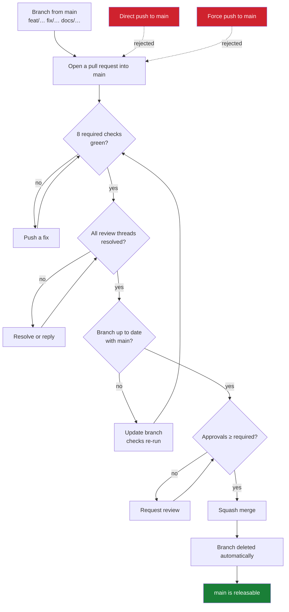

# Repository Governance

How the branching model in
[BRANCHING_STRATEGY.md](BRANCHING_STRATEGY.md) is enforced by GitHub, rather
than by everyone remembering it.

The model is: short-lived branches, pull requests into `main`, squash merge,
immutable release tags. A model that only lives in a document drifts. This
page records the configuration that makes it mechanical, why each rule is
there, and the conditions under which it should change.

Nothing here is a secret. Tokens, actor identifiers, and account details are
deliberately absent — this describes policy, and the live configuration is
readable by anyone with repository access.

## What is enforced

Two repository rulesets and three repository settings.

| Ruleset | Applies to | Effect |
|---|---|---|
| `Protect main` | `refs/heads/main` | Pull request, checks, squash, linear history, no force push, no deletion |
| `Protect release tags` | `refs/tags/v*` | No deletion, no update, no force-move |

| Repository setting | Value |
|---|---|
| Merge commits | disabled |
| Rebase merging | disabled |
| Squash merging | enabled |
| Delete branch on merge | enabled |

Squash is not merely the convention — it is the only merge button the
repository offers, and the ruleset independently rejects anything else.

Rulesets were chosen over classic branch protection because they are
readable through the API as *effective* rules, they apply to tags as well as
branches, and their bypass list is explicit rather than an implied
administrator exemption.

## Authority model

```text
Human Admin
    │
    ├── repository governance
    ├── emergency administration
    └── credential management

Maintainer
    │
    ├── review
    ├── approval
    └── normal merge

AI Agent
    │
    ├── implementation
    ├── tests
    ├── documentation
    ├── branch push
    └── PR creation

    NEVER:
    destructive administration
```

Rulesets enforce the *branch* half of this: nobody, of any role, can push to
`main`, force-push it, or delete it. The *role* half — that an agent does not
administer governance — is enforced by which credential the agent holds, and
is documented in [Agent Governance](AGENT_GOVERNANCE.md#credential-isolation).

## The pull request flow



A new push to the branch dismisses existing approvals, because an approval
describes a diff that no longer exists.

## Required status checks

All eight are reported by `.github/workflows/ci.yml` through the GitHub
Actions app, and every one of them runs unconditionally on every pull request
into `main` — no `paths:` filter, no `if:` condition:

```text
Root module
Processor module (GOWORK=off)
Examples module (GOWORK=off)
Backup, restore & upgrade
Release build (dry run)
Container image (build only)
Workflow action references
Reference deployment
```

That property is load-bearing. A required check that is conditionally skipped
never reports, and a pull request waiting on a check that will never arrive is
indistinguishable from a broken repository. Before adding a `paths:` filter to
any of these jobs, remove it from the required list first.

Each required check is pinned to the app that produces it, so a third party
cannot satisfy a gate by reporting a same-named status.

Checks are **strict**: a branch must be up to date with `main` before it can
merge, so the checks that pass are the checks for the code that will actually
land.

Nightly jobs are excluded on purpose — see
[Branch Protection](BRANCHING_STRATEGY.md#branch-protection).

## Approval requirements

Trustvian currently has **one maintainer**, and GitHub does not allow a pull
request's author to approve their own pull request.

A requirement of one approval would therefore make every pull request
unmergeable except through an administrator bypass. That is strictly worse
than requiring zero: it trains the maintainer to reach for bypass on routine
work, and a bypass habit does not stay confined to the rule that created it.
Approvals are set to `0` for that reason, and only that reason.

`require_extra_approval_for_unattributed_changes` is likewise disabled. GitHub
enables it by default; with a single maintainer it silently raises the
effective requirement to one approval for any commit whose author cannot be
linked to a GitHub account — including the `Co-Authored-By:` trailers this
repository's history carries.

### Upgrade trigger

When a second person with write access joins, in the same change:

| Setting | From | To |
|---|---|---|
| Required approving reviews | `0` | `1` |
| Require last push approval | off | on |
| Extra approval for unattributed changes | off | on |

At three or more maintainers, raise approvals to `2` for changes touching
`internal/policy`, `internal/baseline`, `internal/trust`, or
`.github/workflows/release.yml` — the decision path and the publishing path.
That is the point at which `CODEOWNERS` becomes worth adding; with one
maintainer it would name the same person on every line and require an
approval they cannot give.

## Bypass

**No bypass actors are configured on either ruleset.** Administrators are
subject to the same rules as everyone else.

This is the deliberate choice. The checks exist because `v0.9.0` needed three
release candidates to ship, and each failure was something no one predicted:
an action version that never existed, then a container repository name that
could not be lowercase. A gate that the person most likely to be in a hurry
can step around would not have caught either.

The escape hatch is editing the ruleset itself — visible in the repository's
rule history, deliberate, and reversible — rather than an exemption that
applies invisibly to every push.

## Release tags

`refs/tags/v*` cannot be deleted, updated, or force-moved, by anyone.

Creation is *not* restricted. `release.yml` is triggered by a tag push
(`on: push: tags: ["v*"]`); it does not create tags itself, so restricting
creation would block releases while protecting nothing that immutability does
not already cover.

This is why `v0.9.0-rc.1` and `v0.9.0-rc.2` are still in the history. Both
failed. Both stay — a version number that was published, even to a failed
pipeline, is spent.

## GitHub Actions privilege

| Workflow | Trigger | Privilege |
|---|---|---|
| `ci.yml` | push / PR on `main` | `contents: read` |
| `nightly.yml` | schedule, manual | `contents: read` |
| `release.yml` | tag `v*` | `contents: read`; publish job `contents: write`; container job `packages: write` + `id-token: write` |

Repository-wide, the default `GITHUB_TOKEN` is **read**, and **GitHub Actions
may not approve pull requests**. That second setting matters more than it
looks: with it enabled, a workflow could supply the approving review a ruleset
requires, which would make "human approval" a formality any automated change
could satisfy.

Pull request CI holds no write scope and no secrets, so a fork's pull request
runs untrusted code with no credential worth stealing. `pull_request_target`
is not used anywhere, and must not be introduced — it is the standard way this
property gets lost.

## Reading the live configuration

```bash
# Effective rules on main, whatever their source
gh api repos/trustvian/trustvian/rules/branches/main --jq '.[].type'

# The rulesets themselves, including bypass lists
gh api repos/trustvian/trustvian/rulesets --jq '.[] | "\(.name)  \(.target)  \(.enforcement)"'

# Merge settings
gh api repos/trustvian/trustvian \
  --jq '{allow_squash_merge, allow_merge_commit, allow_rebase_merge, delete_branch_on_merge}'

# Default workflow token, and whether Actions may approve pull requests
gh api repos/trustvian/trustvian/actions/permissions/workflow
```

If `rules/branches/main` returns an empty array, `main` is unprotected and
something has been deleted. It is worth checking after any change to
organization-level policy.

## What is deliberately not configured

| Not configured | Why |
|---|---|
| `CODEOWNERS` | One maintainer; it would name the same person everywhere and, combined with required code-owner review, be unsatisfiable |
| Required signed commits | Worth adopting, but it must not land in the same change as everything else — a signing misconfiguration would block all work at once |
| Organization-level rulesets | Requires organization administration scope; repository rulesets cover the repository that exists |
| Restricting who may push tags | Covered by immutability; restricting creation would block the release workflow's trigger |
| Auto-merge | With one maintainer there is nothing to wait for |

## Related

- [Branching Strategy](BRANCHING_STRATEGY.md) — the model these rules enforce
- [Agent Governance](AGENT_GOVERNANCE.md) — human vs. agent authority, and credential isolation
- [Release Guide](release-guide.md) — producing and verifying a release
- [CONTRIBUTING.md](../CONTRIBUTING.md) — the local gates
