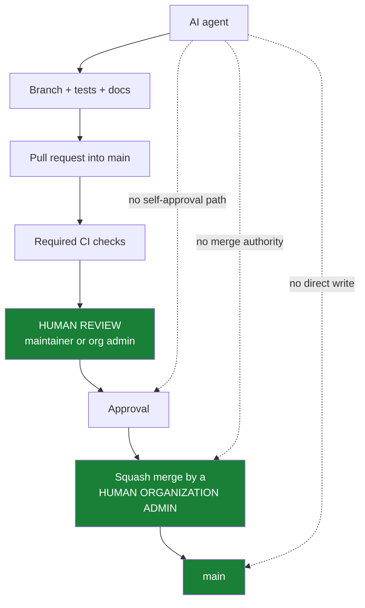

# AI Agent Governance

## Purpose

Trustvian is developed with substantial help from AI coding agents. This
document defines what such an agent may do to this repository, what it may
never do, and — the part that actually matters — which of those limits are
enforced by GitHub rather than by the agent's cooperation.

It is an evergreen policy. It describes roles, not people, and does not
record credentials, tokens, or account identifiers.

## Trust Model

An AI coding agent is a **contributor with no merge authority**, not an
administrator. It proposes changes; humans accept them.

The distinction Trustvian relies on is not "the agent is well-behaved." It is
that the agent's credential should be incapable of destructive administration
in the first place. An instruction file is a reminder; a permission boundary
is a control.

> **Technical capability is not authorization.** An agent that finds itself
> holding a credential able to perform a prohibited action must still not
> perform it — and that situation should be treated as a misconfiguration to
> report, not a convenience to use.

## Human vs Agent Authority

```text
Human Administrator
    │
    ├── repository governance (rulesets, settings, default branch)
    ├── emergency administration
    ├── credential management
    └── final merge authority

Human Maintainer
    │
    ├── review
    ├── approval
    └── (final merge only if also an Organization Admin)

AI Agent
    │
    ├── implementation
    ├── tests
    ├── documentation
    ├── branch creation and push
    └── pull request creation

    NEVER: destructive administration
```

## Allowed Agent Operations

- Read repository contents, settings, rulesets, and CI configuration.
- Create short-lived branches and push to them.
- Open, update, and comment on pull requests — then stop and hand them to a
  human Organization Admin for the merge.
- Read workflow runs, logs, and check results.
- Prepare a release: validation, tests, release notes, a release pull
  request, artifact and signature verification.
- Propose governance changes as documentation and as an explicit,
  human-reviewed plan.

## Prohibited Agent Operations

- Deleting, renaming, force-pushing, or rewriting the history of `main`.
- Pushing directly to `main`, bypassing the pull request path.
- Disabling, deleting, or weakening the `main` ruleset or any branch
  protection.
- Adding any agent, bot, automation identity, or its own credential as a
  ruleset bypass actor — or **using** an existing bypass entry, including the
  Organization Admin bypass, when running under a credential that holds it.
- Changing the repository default branch away from `main`.
- Creating, deleting, moving, or force-updating a release tag; reusing a
  failed release candidate's version number. Tag creation is restricted to a
  human Organization Admin.
- Deleting a GitHub Release, or repairing a failed release by mutating
  published history.
- Approving or merging **any** pull request into `main` — its own or anyone
  else's — or otherwise routing around required human review.
- Enabling auto-merge, or any other mechanism that causes a merge to happen
  without a deliberate human action.
- Rotating, issuing, or altering credentials and secrets.

If a task appears to require one of these, the correct response is to stop and
ask a human — not to find a way.

## Credential Isolation

The security boundary is the credential, not this document.

**Status: PENDING.** No dedicated agent identity exists yet. Until one does,
agents run under a human administrator's credential, every restriction in this
document is compliance rather than enforcement, and the known limitation below
applies in full.

An agent should authenticate as its own least-privilege identity, distinct
from any human administrator's:

```text
Human administrator credential        Agent credential
    │                                     │
    └── repository administration         ├── contents: read/write (branches)
        ruleset administration            ├── pull requests: read/write
        credential management             ├── metadata: read
                                          ├── actions: read
                                          └── packages: read

                                          NOT: administration
                                          NOT: ruleset administration
                                          NOT: secrets
```

Recommended minimum for a fine-grained personal access token scoped to this
repository alone:

| Permission | Level | Why |
|---|---|---|
| Metadata | Read | Mandatory for any fine-grained token |
| Contents | Read and write | Create and push short-lived branches — **also authorizes merging**, see below |
| Pull requests | Read and write | Open and update pull requests |
| Actions | Read | Inspect workflow runs and check results |
| Packages | Read | Verify published container images |
| Issues | Read and write | Only if the agent triages issues |
| Administration | **None** | The whole point |
| Secrets, Environments, Webhooks | **None** | — |

A classic personal access token is not a substitute. Classic `repo` is a
single scope covering code, settings, and — for a user who administers the
repository — its rulesets. It cannot express "may push a branch, may not
rewrite governance," which is precisely the line this policy needs.

Credential separation removes administration from the agent. It does **not**,
by itself, remove the ability to merge — see the analysis below, which
corrects an earlier claim in this document.

> **Known limitation.** When an agent runs with a human administrator's
> unrestricted credential, GitHub cannot distinguish the agent's API calls
> from the human's. Every restriction in this document then rests on the
> agent's compliance, which is defense in depth, not a boundary. Do not
> describe such a setup as secure; treat it as a temporary state to be fixed
> by issuing the agent its own token.

### Merge capability: what a token permission actually grants

GitHub authorizes these operations as follows (REST, fine-grained tokens):

| Operation | Endpoint | Permission required |
|---|---|---|
| Push a branch | git / `contents` | **Contents: write** |
| Merge a pull request | `PUT /repos/{o}/{r}/pulls/{n}/merge` | **Contents: write** |
| Create a pull request | `POST /repos/{o}/{r}/pulls` | **Pull requests: write** |
| Submit an approving review | `POST /repos/{o}/{r}/pulls/{n}/reviews` | **Pull requests: write** |

Two consequences follow, and neither is optional to acknowledge:

- **Pushing a branch and merging a pull request are the same permission.**
  There is no token permission that says "may push a branch, may not merge."
  An agent credential able to push its own working branch into this
  repository is, by construction, able to merge any pull request that
  satisfies the branch rules.
- **Creating a pull request and approving one are the same permission.**
  An identity that can open a pull request can also submit an approving
  review on someone else's.

GitHub offers no way to separate these pairs by permission. The only native
mechanism that restricts *who* may merge is the classic branch-protection
push restriction, which requires a GitHub Team or Enterprise plan and
enumerates identities rather than expressing a role.

#### What this means for the agent identity

Two workable models, with different guarantees:

| Model | Agent write access to this repository | Can the agent merge? |
|---|---|---|
| **Fork-based** — agent pushes to its own fork and opens a cross-repository pull request | None (`Contents: read`) | **No** — technically prevented |
| **Direct-branch** — agent pushes short-lived branches to this repository | `Contents: write` | **Yes** — prevented only by policy |

The fork-based model is the one that makes "an agent cannot merge" a fact
rather than a promise, and it costs nothing here: pull request CI already
runs with `contents: read` and no secrets, so a fork's pull request receives
the identical gate set.

In either model, a residual capability remains: an agent identity holding
`Pull requests: write` can submit an approving review. GitHub cannot
distinguish a machine account's review from a human's. That risk is
mitigated by attribution rather than permission — a review from the agent
identity is visibly attributed to it, and this policy forbids counting one as
the required human approval. Anyone reviewing the repository's history can
check whether it was honoured.

## Protected Branches

`main` is the canonical branch and the repository default.

```text
main

delete        → DENIED
force push    → DENIED
direct push   → DENIED
history rewrite → DENIED

normal write path:
    short-lived branch → pull request → required CI → human approval
        → squash merge → main
```

Changing the default branch away from `main` is a human-administrator
governance operation. Agents must not perform it.

The enforcing configuration is documented in
[repository.md](repository.md).

## Pull Request Requirements



No agent self-approval path may be designed, configured, or relied upon.
GitHub Actions is not permitted to approve pull requests in this repository,
and that setting is part of the audited configuration.

### The authority chain

```text
Agent
  |
  v
PR
  |
  +-- CI
  |
  v
Human Reviewer
Maintainer OR Organization Admin
  |
  v
Approval
  |
  v
Human Organization Admin
  |
  v
Final Merge
  |
  v
main
```

Two distinct authorities, which may be held by the same person:

| Authority | Who holds it | What it permits |
|---|---|---|
| Review | An authorized human maintainer, or an Organization Admin | Approving a pull request |
| Final merge | A human Organization Admin **only** | Performing the merge into `main` |

An Organization Admin who reviewed a pull request may also merge it — the
policy requires one valid human approval and an admin merge, not two separate
people. A maintainer who is not an Organization Admin may approve but must not
merge.

Organization Admin status is an *additional* authorization to merge. It is not
permission to bypass anything: an admin's merge must still satisfy the pull
request, the required checks, the approval, and conversation resolution, the
same as anyone else's.

## Release Safety

An agent may prepare a release and verify one. It may not repair one.

```text
failed release candidate
        ↓
    fix branch
        ↓
    pull request
        ↓
        CI
        ↓
 human-reviewed merge
        ↓
 next immutable RC
```

A release candidate that failed keeps its version number forever. `v0.9.0`
took three candidates; `v0.9.0-rc.1` and `rc.2` remain in the history as
evidence of what failed and why. Recycling a tag would erase that, and an
agent must never do it — a failed release is fixed by moving forward, never by
rewriting what was published.

## GitHub Actions

Workflow privilege is scoped per job, not per repository:

| Workflow | Trigger | Privilege |
|---|---|---|
| `ci.yml` | push / PR on `main` | `contents: read` only — no secrets, nothing to leak to a fork pull request |
| `nightly.yml` | schedule, manual | `contents: read` only |
| `release.yml` | version tag | `contents: read` by default; the publish job adds `contents: write`, the container job adds `packages: write` and `id-token: write` for keyless signing |

Rules for changing this:

- The default `permissions:` at workflow level is `contents: read`. Widen it
  on a *job*, never on a workflow.
- Pull request CI must never gain write privilege. A fork's pull request runs
  untrusted code; the reason it is safe here is that the job holds no
  credential worth stealing.
- `pull_request_target` must not be introduced. It runs with the base
  repository's token in the context of untrusted code, and this repository has
  no use case that justifies it.
- Release privileges (`packages: write`, `id-token: write`) belong to the
  tag-triggered workflow only, and must not migrate into pull request CI.

## Emergency Administration

Recovery from a governance mistake is a deliberate human action: a signed-in
administrator editing the ruleset in the GitHub UI, where the change is
recorded in the repository's rule history.

A scoped bypass entry also exists on both rulesets, held by Organization
Admin: pull-request-only on `main`, and unrestricted on `v*` tags so that a
human can create a release. Neither is available through an agent credential,
and an agent must never use one even while running under a credential that
technically holds it. Their scope and the reason each exists are in
[Repository Governance](repository.md#bypass).

The distinction still worth keeping: a bypass applies whenever its holder
acts, while editing a ruleset is visible in the repository's rule history and
has to be chosen deliberately. Prefer the second for anything structural.

## Security Invariants

AI agents and automated tools must never:

- delete `main`;
- rename `main`;
- force-push `main`;
- rewrite `main` history;
- disable or weaken the `main` ruleset;
- add themselves as ruleset bypass actors;
- change the default branch away from `main`;
- delete or move release tags;
- delete releases to repair failed releases;
- bypass required human review.

These restrictions apply even when the agent is technically authenticated
using credentials capable of performing the action.

Technical capability is not authorization.

## Related

- [Repository Governance](repository.md) — the enforced configuration
- [Release Governance](releases.md) — release and tag authority
- [Branching Strategy](branching.md) — the development model
- [CLAUDE.md](../../CLAUDE.md) — the in-repository reminder for coding agents
- [AGENTS.md](../../AGENTS.md) — the vendor-neutral agent rules
