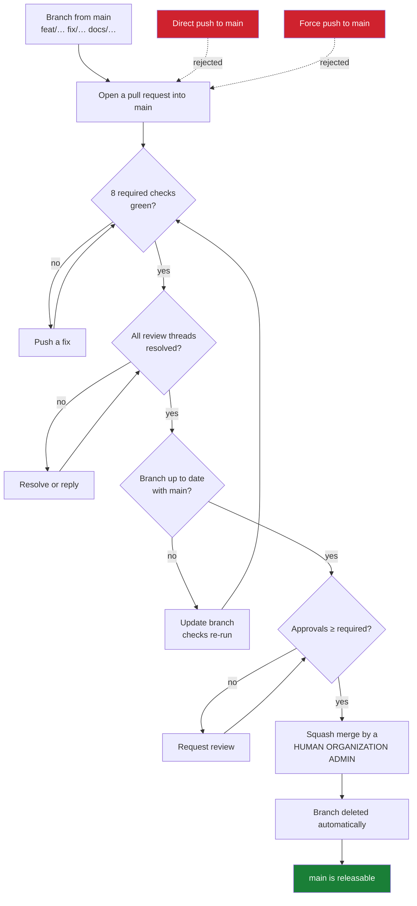

# Repository Governance

How the branching model in
[branching.md](branching.md) is enforced by GitHub, rather
than by everyone remembering it.

The model is: short-lived branches, pull requests into `main`, squash merge,
immutable release tags. A model that only lives in a document drifts. This
page records the configuration that makes it mechanical, why each rule is
there, and the conditions under which it should change.

Nothing here is a secret. Tokens, actor identifiers, and account details are
deliberately absent — this describes policy, and the live configuration is
readable by anyone with repository access.

## What is enforced

Two repository rulesets and three repository settings.

| Ruleset | Applies to | Effect |
|---|---|---|
| `Protect main` | `refs/heads/main` | Pull request, checks, squash, linear history, no force push, no deletion |
| `Protect release tags` | `refs/tags/v*` | No creation, deletion, update, or force-move — except by an Organization Admin |

| Repository setting | Value |
|---|---|
| Merge commits | disabled |
| Rebase merging | disabled |
| Squash merging | enabled |
| Delete branch on merge | enabled |

Squash is not merely the convention — it is the only merge button the
repository offers, and the ruleset independently rejects anything else.

Rulesets were chosen over classic branch protection because they are
readable through the API as *effective* rules, they apply to tags as well as
branches, and their bypass list is explicit rather than an implied
administrator exemption.

## Authority model

```text
Human Admin (Organization Admin)
    │
    ├── repository governance
    ├── emergency administration
    ├── credential management
    ├── review and approval
    └── FINAL MERGE into main

Maintainer
    │
    ├── review
    └── approval

AI Agent
    │
    ├── implementation
    ├── tests
    ├── documentation
    ├── branch push
    └── PR creation

    NEVER:
    destructive administration
```

Rulesets enforce the *branch* half of this: nobody, of any role, can push to
`main`, force-push it, or delete it. The *role* half — that an agent does not
administer governance — is enforced by which credential the agent holds, and
is documented in [Agent Governance](agents.md#credential-isolation).

## The pull request flow



A new push to the branch dismisses existing approvals, because an approval
describes a diff that no longer exists.

## Required status checks

All eight are reported by `.github/workflows/ci.yml` through the GitHub
Actions app, and every one of them runs unconditionally on every pull request
into `main` — no `paths:` filter, no `if:` condition:

```text
Root module
Processor module (GOWORK=off)
Examples module (GOWORK=off)
Backup, restore & upgrade
Release build (dry run)
Container image (build only)
Workflow action references
Reference deployment
```

That property is load-bearing. A required check that is conditionally skipped
never reports, and a pull request waiting on a check that will never arrive is
indistinguishable from a broken repository. Before adding a `paths:` filter to
any of these jobs, remove it from the required list first.

Each required check is pinned to the app that produces it, so a third party
cannot satisfy a gate by reporting a same-named status.

Checks are **strict**: a branch must be up to date with `main` before it can
merge, so the checks that pass are the checks for the code that will actually
land.

Nightly jobs (`PostgreSQL stress tier`, `Reference deployment smoke test`,
`Reference deployment recovery drill`) are **not** required checks. They are
scheduled tiers, and requiring them would block every pull request on work
that is valuable as a trend rather than as a per-change gate. The release
checklist consults them instead.

## Review authority

At least one human approval is policy for every pull request into `main`.

| Authority | Who holds it |
|---|---|
| Review and approval | An authorized human maintainer **or** an Organization Admin |
| Final merge into `main` | A human Organization Admin **only** |

One person may hold every role — Organization Admin, maintainer, reviewer, and
final merger. The policy requires one valid human approval plus an admin
merge; it does not require two separate people. A maintainer who is not an
Organization Admin may approve but must not perform the merge.

Organization Admin status is an additional authorization to merge. It is not
*intended* as permission to skip the gates — but as of the current
configuration it technically is one, through a scoped bypass described under
[Bypass](#bypass). The normal path runs through the gates; the bypass is an
exception, not the route.

### Enforced value: `1`

One approving review is required, and it is enforced by the ruleset — not
merely policy. GitHub does not permit a pull request's author to approve their
own, so this is a genuine second-party check for any pull request whose author
is not the reviewer.

`require_extra_approval_for_unattributed_changes` and
`require_last_push_approval` are both **off**. The first would raise the
effective requirement to two approvals for any commit whose author cannot be
linked to a GitHub account — including the `Co-Authored-By:` trailers this
repository's history carries. The second requires the most recent push to be
approved by someone other than the pusher, which is correct once a second
reviewer exists and unsatisfiable before then. Both are listed in the target
table below.

### The single-maintainer consequence

Trustvian has one human. A pull request that human authors has no eligible
reviewer, because self-approval is impossible and no other human can approve. Under a one-approval rule that
pull request is unmergeable on the normal path — which is precisely why the
scoped bypass below exists.

This is a stopgap, not the design. It disappears when a second reviewing
identity exists; see [Current and target state](#current-and-target-state).

## Current and target state

| Control | Current | Target |
|---|---|---|
| Pull request required | YES | YES |
| Required CI checks | 8, strict | 8, strict |
| Required human approvals | 1 | 1 |
| Conversation resolution | YES | YES |
| Force push / deletion of `main` | DENIED | DENIED |
| Squash-only, linear history | YES | YES |
| Organization Admin PR bypass | PRESENT (stopgap) | REMOVED |
| Require last push approval | off | on |
| Extra approval for unattributed changes | off | on |
| Dedicated agent identity | **PENDING** | YES |
| Agent merge capability | not yet isolated | NO |

`Current` records only what GitHub reports. Nothing in that column is marked
complete because a document describes it.

Once a **second eligible human reviewer** exists — another authorized
maintainer or Organization Admin — the bypass entry should be removed and the
two approval sub-settings switched on.

A dedicated agent identity does not end this condition. It is not an eligible
human reviewer, and a review submitted by one does not satisfy the required
human approval: one human admin plus an agent is still a project with one
human maintainer. What the agent identity does change is separate and also
worth having — it makes agent-authored pull requests reviewable by the human,
and removes the agent's technical ability to merge (see
[Agent Governance](agents.md#credential-isolation)). Neither of those supplies
the second human.

At three or more maintainers, raise approvals to `2` for changes touching
`internal/policy`, `internal/baseline`, `internal/trust`, or
`.github/workflows/release.yml` — the decision path and the publishing path.
That is also the point at which `CODEOWNERS` becomes worth adding; with one
maintainer it would name the same person on every line.

## Merge authority

GitHub has **no native rule** that restricts who may perform a merge by
organization role. This was investigated rather than assumed:

| Mechanism | Can it express "only an Organization Admin may merge"? |
|---|---|
| Repository rulesets | No. Rulesets gate *what* may reach a ref, not *who* performs the merge. Their only actor concept is `bypass_actors`, which grants exemption from the rules — the opposite of what is wanted |
| Organization rulesets | Same rule vocabulary; no merge-actor restriction |
| Classic branch protection `restrictions` | Closest native mechanism: an allow-list of users/teams that may push to, and therefore merge into, the branch. It enumerates identities rather than expressing the *role*, and is unavailable to this organization's plan |
| Custom repository roles | Not available on this organization's plan |
| Required status checks | Cannot help: no check can know who will click merge, because the merger does not exist until the merge happens |
| Merge queue | Actively harmful here — see below |

So the merge boundary is enforced by **credentials**, not by a branch rule:
whoever holds a credential with write access to the repository can merge a
pull request that satisfies the rules. Restricting the set of humans and
tokens holding that access *is* the enforcement mechanism.

The credential model therefore decides what is enforced, and the detail that
decides it is this: **pushing a branch and merging a pull request are the same
token permission** (`Contents: write`). An agent that can push a working
branch into this repository can also merge. Only an agent working from a fork,
with no write access here at all, is technically unable to merge — the
analysis and the trade-off are in
[Agent Governance](agents.md#merge-capability-what-a-token-permission-actually-grants).

While an agent runs with the Organization Admin's own unrestricted credential,
GitHub sees the admin's authority and the boundary is compliance rather than
control.

### Merge queue

Not enabled, and it must not be. A merge queue makes GitHub's own automation
perform the final merge: the admin approves entry to the queue, and a bot
commits the result. That directly contradicts a policy whose point is that a
named human performs a deliberate final action.

### Auto-merge

Disabled repository-wide (`allow_auto_merge: false`). Auto-merge converts the
merge into a background event that fires whenever the last check goes green —
exactly the deliberate human step this model reserves for an Organization
Admin. An agent must never enable it.

## Final-merge checklist

For the Organization Admin performing the merge:

```text
[ ] PR targets main
[ ] required CI passed
[ ] branch is current where required
[ ] >=1 valid human approval exists
[ ] no stale approval remains
[ ] conversations resolved
[ ] no unexpected privileged workflow change
[ ] squash commit/title acceptable
[ ] I am intentionally performing the final merge as a Human Organization Admin
```

The seventh line is the one worth slowing down for: a change to
`.github/workflows/`, a new `permissions:` block, or a new action reference
deserves a second look, because it is the part of a diff that can alter what
CI itself is allowed to do.

## Bypass

Both rulesets grant a bypass entry to **Organization Admin**, with different
scopes:

| Ruleset | Bypass actor | Mode | Effect |
|---|---|---|---|
| `Protect main` | Organization Admin | `pull_request` | May merge a pull request that does not satisfy the rules. **Cannot** push, force-push, or delete `main` directly — that is not a pull request |
| `Protect release tags` | Organization Admin | `always` | May create, and if necessary correct, `v*` tags |

Read `pull_request` mode precisely: it is not an exemption from the pull
request *path*, it is an exemption available *within* it. Direct pushes to
`main` remain impossible for everyone, administrators included. What an
administrator can do is complete a merge that the approval or check rules
would otherwise hold.

### Why the `main` bypass exists

It is a **single-maintainer escape hatch**, and nothing more:

```text
Organization Admin authors a pull request
        |
        v
cannot self-approve  (GitHub forbids it)
        |
        v
no second human reviewer exists
        |
        v
PR-only bypass allows the merge to complete
```

Without it, a one-approval rule and a one-person project mean nothing merges
at all — including the change that would fix the situation.

It is **not** the normal merge path. The normal path is unchanged:

```text
PR -> CI -> >=1 human approval -> conversations resolved
   -> Human Organization Admin final merge
```

Using the bypass is an exception that should be visible and rare, and it
should be removed once a second eligible *human* reviewer exists — an agent
identity is not one. AI agents must
never use it, whatever credential they hold — see
[Agent Governance](agents.md).

### Why the tag bypass is different

The tag bypass is `always` rather than `pull_request` for a structural reason:
**a tag is not a pull request**, so `pull_request` mode would grant nothing at
all on a tag ruleset.

With `creation` now restricted, some actor has to be able to create a release
tag, or releases stop entirely. That authority is deliberately given to a
human Organization Admin and to nobody else — not to CI, not to
`GITHUB_TOKEN`, not to an agent. It is controlled release authority rather
than a general protection bypass.

## Release tags

Tags matching `v*` are protected against **creation**, deletion, update, and
force-move. A human Organization Admin is the authorized bypass actor; every
other identity is refused, including `GITHUB_TOKEN`.

That makes published tags immutable in the strict sense: `v0.9.0`,
`v0.9.0-rc.1`, `rc.2`, and `rc.3` cannot be moved or deleted by any normal
actor, and no workflow can mint a new one.

What a tag *means* once it exists — candidate immutability, same-SHA
promotion, what a human must do rather than automation — is
[Release Governance](releases.md).

## GitHub Actions privilege

| Workflow | Trigger | Privilege |
|---|---|---|
| `ci.yml` | push / PR on `main` | `contents: read` |
| `nightly.yml` | schedule, manual | `contents: read` |
| `release.yml` | tag `v*` | `contents: read`; publish job `contents: write`; container job `packages: write` + `id-token: write` |

No workflow merges pull requests or pushes to `main`: there is no `gh pr
merge`, no `pulls.merge`, and no `git push origin main` anywhere in
`.github/workflows/`. The only `contents: write` is the release job that
creates a GitHub Release from a tag — and even that token cannot reach `main`,
because `GITHUB_TOKEN` is not a bypass actor on the ruleset.

Repository-wide, the default `GITHUB_TOKEN` is **read**, and **GitHub Actions
may not approve pull requests**. That second setting matters more than it
looks: with it enabled, a workflow could supply the approving review a ruleset
requires, which would make "human approval" a formality any automated change
could satisfy.

Pull request CI holds no write scope and no secrets, so a fork's pull request
runs untrusted code with no credential worth stealing. `pull_request_target`
is not used anywhere, and must not be introduced — it is the standard way this
property gets lost.

## Reading the live configuration

```bash
# Effective rules on main, whatever their source
gh api repos/trustvian/trustvian/rules/branches/main --jq '.[].type'

# The rulesets themselves, including bypass lists
gh api repos/trustvian/trustvian/rulesets --jq '.[] | "\(.name)  \(.target)  \(.enforcement)"'

# Merge settings
gh api repos/trustvian/trustvian \
  --jq '{allow_squash_merge, allow_merge_commit, allow_rebase_merge, delete_branch_on_merge}'

# Default workflow token, and whether Actions may approve pull requests
gh api repos/trustvian/trustvian/actions/permissions/workflow
```

If `rules/branches/main` returns an empty array, `main` is unprotected and
something has been deleted. It is worth checking after any change to
organization-level policy.

## What is deliberately not configured

| Not configured | Why |
|---|---|
| `CODEOWNERS` | One maintainer; it would name the same person everywhere and, combined with required code-owner review, be unsatisfiable. Deferred, not rejected |
| Required signed commits | Worth adopting, but it must not land in the same change as everything else — a signing misconfiguration would block all work at once |
| Organization-level rulesets | Requires organization administration scope; repository rulesets cover the repository that exists |
| Auto-merge | It would remove the deliberate human merge action this model is built around |
| Merge queue | GitHub's automation would become the effective final merger |

## Related

- [Branching Strategy](branching.md) — the model these rules enforce
- [Release Governance](releases.md) — release and tag authority
- [Agent Governance](agents.md) — human vs. agent authority, and credential isolation
- [Commit Convention](../COMMIT_CONVENTION.md) — commit and pull request titles
- [Release Guide](../release-guide.md) — producing and verifying a release
- [CONTRIBUTING.md](../../CONTRIBUTING.md) — the local gates
